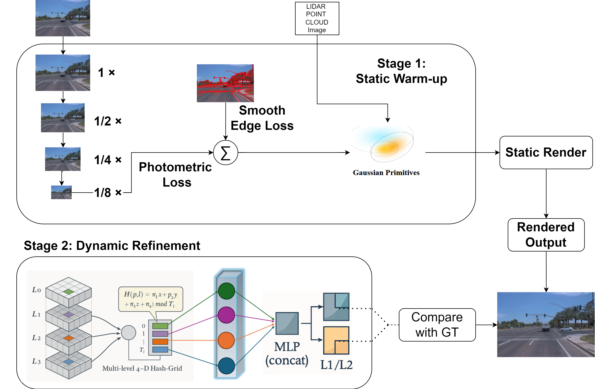
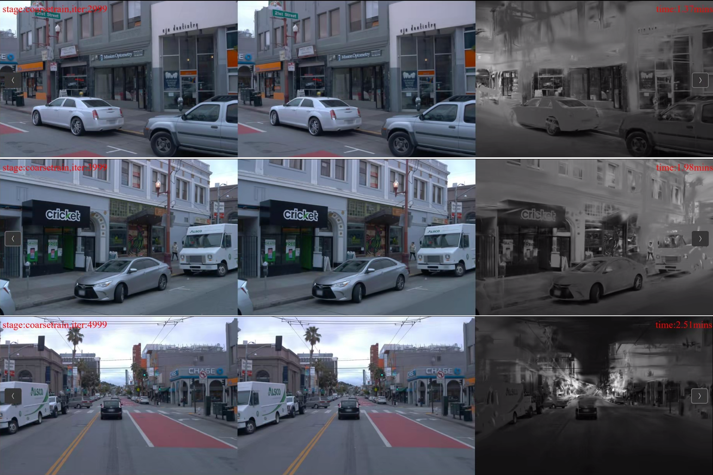
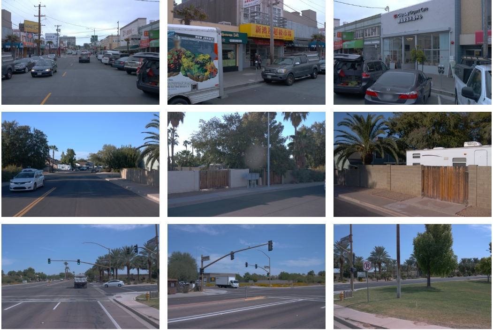

# 基于哈希编码器的自监督街景高斯模型

## 项目简介

本项目提出了一种基于3D高斯的自监督街景建模方法，专门用于自动驾驶场景的动态场景重建和新视角合成。我们采用多分辨率哈希编码器进行4D时空特征编码，实现高效的动态场景建模。

### 核心技术方案

本项目采用两阶段训练策略，结合先进的哈希编码技术：

1. **静态场景重建阶段**：首先对静态背景进行建模，建立场景的基础3D高斯表示
2. **动态场景建模阶段**：在静态模型基础上，使用哈希编码器学习动态物体的时空变形

### 主要技术特点

- ✅ **多分辨率哈希编码器**：高效的4D时空特征编码，显著降低内存使用
- ✅ **两阶段训练策略**：静态→动态的渐进式训练，提高训练效率
- ✅ **自监督学习**：无需额外标注，仅使用多视角图像进行训练
- ✅ **高质量渲染**：支持实时渲染和高质量的新视角合成



## 📊 论文核心实验结果

### 1. Waymo-NOTR 数据集定量对比
| 方法 | PSNR ↑ | SSIM ↑ | LPIPS ↓ | DPSNR ↑ | DSSIM ↑ |
|------|-------|--------|---------|---------|---------|
| 3D GS | 27.68 | 0.845 | 0.142 | 23.53 | 0.754 |
| EmerNeRF | 30.64 | 0.897 | 0.102 | 27.61 | 0.856 |
| LiHi-GS | 32.65 | 0.917 | 0.098 | 28.38 | 0.889 |
| S³Gaussian | 30.10 | 0.895 | 0.113 | 23.78 | 0.728 |
| **Ours** | **34.06** | **0.947** | **0.045** | **28.97** | **0.871** |

💡 **亮点**：相比 S³Gaussian，PSNR 提升 **+3.96 dB**，LPIPS 降低 **60%**，且显存占用减少一半。

### 2. 消融实验（Waymo-NOTR, dynamic32）
| 配置 | PSNR↑ | LPIPS↓ | 显存 (GB) | 时间 (h) |
|------|-------|--------|-----------|----------|
| Baseline (S³) | 30.10 | 0.113 | 40.3 | 2.12 |
| + Lphoto+Lsmooth | 32.81 | 0.069 | 21.6 | 1.03 |
| + Hash grid | 32.36 | 0.078 | 21.4 | 1.02 |
| **+ ℓ1/ℓ2 (full)** | **34.06** | **0.045** | 21.9 | 1.02 |

### 3. 渲染效果展示

#### 📌 场景重建 (左：GT | 中：渲染结果 | 右：深度图)
  

#### 📌 新视角合成 (三场景 Front / Front-Left / Front-Right)
  


### 4. 动态效果演示
<video src="https://github.com/user-attachments/assets/8803aa96-6313-4dc8-a631-f82ddc442096" autoplay loop muted playsinline width="800">
</video>

## 环境配置

### 系统要求

- **操作系统**: Ubuntu 22.04 (推荐) 
- **Python**: 3.9
- **PyTorch**: 1.13.1+cu116 或 2.2.1+cu118
- **CUDA**: 11.6+ (推荐) 或 11.8
- **内存**: 16GB+ RAM
- **显存**: 8GB+ VRAM (推荐12GB+)

### 安装步骤

1. **克隆项目仓库**
```bash
git clone <https://github.com/Embracely/4dhash/blob/main/README.md> --recursive
cd <project-directory>
```

2. **创建并激活Conda环境**
```bash
conda create -n 4DHash python=3.9 
conda activate 4DHash
```

3. **安装Python依赖**
```bash
pip install -r requirements.txt
pip install -e submodules/depth-diff-gaussian-rasterization
pip install -e submodules/simple-knn
```


## 数据集准备

### 1. 注册Waymo Open Dataset账户

首先需要在 [Waymo Open Dataset](https://waymo.com/open/) 注册账户，并安装gcloud SDK。详细步骤请参考 [官方文档](https://cloud.google.com/sdk/docs/install)。

### 2. 创建数据目录

```bash
mkdir -p ./data/waymo/raw   
mkdir -p ./data/waymo/processed 
```

### 3. 下载原始数据

**方式一：使用脚本下载（推荐）**

下载特定场景（例如场景22, 700, 754）：
```bash
python data/download_waymo.py \
    --target_dir ./data/waymo/raw \
    --scene_ids 22 700 754
```

下载预定义的数据分割：
```bash
# 下载静态场景数据集（Static32）
python data/download_waymo.py --split_file data/waymo_splits/static32.txt

# 下载动态场景数据集（Dynamic32）
python data/download_waymo.py --split_file data/waymo_splits/dynamic32.txt
```

**方式二：手动下载**

如果无法使用脚本下载，可以从 [Waymo控制台](https://console.cloud.google.com/storage/browser/waymo_open_dataset_scene_flow/train) 手动下载数据。

### 4. 数据预处理

使用我们提供的预处理脚本：

```bash
python preprocess_main.py \
    --data_root data/waymo/raw/ \
    --target_dir data/waymo/processed \
    --split training \
    --process_keys images lidar calib pose dynamic_masks \
    --workers 4 \
    --scene_ids 022
```

对于批量处理：
```bash
python preprocess_main.py \
    --data_root data/waymo/raw/ \
    --target_dir data/waymo/processed \
    --split training \
    --process_keys images lidar calib pose dynamic_masks \
    --workers 8 \
    --split_file data/waymo_splits/dynamic32.txt
```

**注意**: 如果遇到 `TypeError: 'numpy._DTypeMeta' object is not subscriptable` 错误，请使用 `pip install numpy==1.26.1`。

### 5. 数据目录结构

预处理完成后，数据目录结构如下：
```
data/waymo/processed/
├── training/
│   ├── 022/                    # 场景ID
│   │   ├── dynamic_masks/      # 动态掩码
│   │   ├── ego_pose/          # 车辆位姿
│   │   ├── extrinsics/        # 相机外参
│   │   ├── images/            # 图像数据
│   │   ├── intrinsics/        # 相机内参
│   │   ├── lidar/             # 激光雷达数据
│   │   └── sky_masks/         # 天空掩码
│   └── ...                    # 其他场景
```

## 训练流程

### 🚀 推荐：使用一键训练脚本

我们推荐使用一键训练脚本，它会自动完成静态场景训练→动态场景训练的完整流程：

**完整训练**
```bash
./train_integrated.sh \
    --model_path ./work_dirs/integrated/full_training \
    --source_path ./data/waymo/processed/training/022
```

**快速测试**
```bash
./train_integrated.sh \
    --model_path ./work_dirs/integrated/test_training \
    --source_path ./data/waymo/processed/training/022 \
    --mode test
```

**自定义迭代次数**
```bash
./train_integrated.sh \
    --model_path ./work_dirs/integrated/custom_training \
    --source_path ./data/waymo/processed/training/022 \
    --iterations 30000
```

### 高级训练选项

**1. 使用哈希编码器训练（单阶段）**
```bash
./train_hash_encoder.sh \
    --model_path ./work_dirs/hash_training \
    --source_path ./data/waymo/processed/training/022 \
    --encoder hash \
    --task scene_reconstruction \
    --mode full
```

**2. 手动分阶段训练**

如果您想要更精细的控制，可以手动执行分阶段训练：

```bash
# 第一阶段：静态场景重建
python train.py \
    -s ./data/waymo/processed/training/022 \
    --model_path ./work_dirs/manual/stage1 \
    --configs arguments/phase1_static.py \
    --iterations 5000

# 第二阶段：动态场景训练
python train.py \
    -s ./data/waymo/processed/training/022 \
    --model_path ./work_dirs/manual/stage2 \
    --configs arguments/phase2_dynamic.py \
    --prior_checkpoint ./work_dirs/manual/stage1/chkpnt_fine_5000.pth \
    --iterations 50000 \
    --encoder_type hash
```

### 训练参数说明

| 参数 | 说明 | 默认值 |
|------|------|--------|
| `--model_path` | 模型输出路径 | 必需 |
| `--source_path` | 数据源路径 | 必需 |
| `--mode` | 训练模式：`test`(快速测试) 或 `full`(完整训练) | `full` |
| `--iterations` | 第二阶段迭代次数 | 50000 |
| `--encoder_type` | 编码器类型：`hash` 或 `hexplane` | `hash` |

## 评估与可视化

### 性能评估

训练完成后，使用评估脚本计算各项指标：

```bash
python eval_metrics.py \
    --model_path ./work_dirs/integrated/full_training \
    --iteration 50000
```

### 可视化结果

生成渲染视频和可视化结果：

```bash
python train.py \
    -s ./data/waymo/processed/training/022 \
    --model_path ./work_dirs/integrated/full_training \
    --start_checkpoint ./work_dirs/integrated/full_training/chkpnt_fine_50000.pth \
    --eval_only
```

生成的结果包括：
- RGB渲染视频
- 真实RGB视频
- 深度视频
- 动态物体RGB视频
- 静态背景RGB视频

### 性能指标

评估结果将包含以下指标：
- **PSNR**: 峰值信噪比
- **SSIM**: 结构相似性指数
- **LPIPS**: 感知图像块相似度
- **渲染速度**: FPS
- **内存使用**: GPU内存占用

### 核心文件说明

- `train_integrated.sh` - **推荐的一键训练脚本**
- `arguments/integrated_training.py` - **训练配置文件**
- `scene/hash_encoder.py` - **哈希编码器实现**
- `scene/deformation_hash.py` - **哈希变形网络**
- `eval_metrics.py` - 评估脚本

## 致谢

本项目在实现过程中参考了以下优秀的开源项目：

- [4D Gaussians](https://github.com/hustvl/4DGaussians/tree/master) - 4D高斯建模技术
- [EmerNeRF](https://github.com/NVlabs/EmerNeRF) - 数据处理流程
- [StreetGaussians](https://github.com/zju3dv/street_gaussians) - 街景建模参考

感谢所有开源贡献者的辛勤工作！

## 相关工作

本项目的技术方案受到以下研究工作的启发：

```bibtex
@article{huang2024s3gaussian,
    title={S3Gaussian: Self-Supervised Street Gaussians for Autonomous Driving},
    author={Huang, Nan and Wei, Xiaobao and Zheng, Wenzhao and An, Pengju and Lu, Ming and Zhan, Wei and Tomizuka, Masayoshi and Keutzer, Kurt and Zhang, Shanghang},
    journal={arXiv preprint arXiv:2405.20323},
    year={2024}
}
```

## 许可证

本项目遵循原始项目的许可证。详细信息请参考 [LICENSE.md](LICENSE.md)。

## 快速开始示例

```bash
# 1. 准备数据
python preprocess_main.py --data_root data/waymo/raw/ --target_dir data/waymo/processed --split training --scene_ids 022

# 2. 开始训练
./train_integrated.sh --model_path ./work_dirs/my_experiment --source_path ./data/waymo/processed/training/022

# 3. 评估结果
python eval_metrics.py --model_path ./work_dirs/my_experiment --iteration 50000
```

祝您使用愉快！🚀


