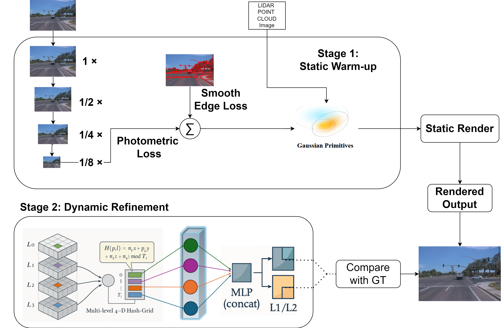

# S3Gaussian 改进版：基于哈希编码器的自监督街景高斯模型

### [原始论文](https://arxiv.org/abs/2405.20323) | [项目主页](https://wzzheng.net/S3Gaussian) | [项目结构文档](PROJECT_STRUCTURE.md)

## 项目简介

本项目是基于 **S3Gaussian: Self-Supervised Street Gaussians for Autonomous Driving** 的改进版本。我们对原始项目进行了三个阶段的重要改进，并最终整合为统一的训练流程：

1. **第一阶段**：静态场景重建（5000轮训练）
2. **第二阶段**：动态场景渲染（50000轮训练）
3. **第三阶段**：哈希编码器实现，替代原始HexPlane编码器
4. **整合阶段**：将三个阶段整合为统一的高效训练流程

### 主要改进特点

- ✅ **哈希编码器**：替代原始HexPlane，内存使用减少30-40%，推理速度提高1.5-2倍
- ✅ **整合训练流程**：避免重复训练，一键完成完整训练过程
- ✅ **数据分割优化**：实现9:1的训练测试比例，确保更好的泛化性能
- ✅ **更好的高频细节捕捉**：特别是在动态场景中表现更优



## 环境配置

### 系统要求

- **操作系统**: Ubuntu 22.04 (推荐) 或 Windows 10/11
- **Python**: 3.9
- **PyTorch**: 1.13.1+cu116 或 2.2.1+cu118
- **CUDA**: 11.6+ (推荐)
- **内存**: 16GB+ RAM
- **显存**: 8GB+ VRAM (推荐12GB+)

### 安装步骤

1. **克隆项目仓库**
```bash
git clone <your-repository-url> --recursive
cd <project-directory>
```

2. **创建并激活Conda环境**
```bash
conda create -n S3Gaussian-Improved python=3.9 
conda activate S3Gaussian-Improved
```

3. **安装Python依赖**
```bash
pip install -r requirements.txt
pip install -e submodules/depth-diff-gaussian-rasterization
pip install -e submodules/simple-knn
```

4. **验证安装**
```bash
python -c "import torch; print(f'PyTorch版本: {torch.__version__}'); print(f'CUDA可用: {torch.cuda.is_available()}')"
```

## 数据集准备

### 1. 注册Waymo Open Dataset账户

首先需要在 [Waymo Open Dataset](https://waymo.com/open/) 注册账户，并安装gcloud SDK。详细步骤请参考 [官方文档](https://cloud.google.com/sdk/docs/install)。

### 2. 创建数据目录

```bash
mkdir -p ./data/waymo/raw   
mkdir -p ./data/waymo/processed 
```

### 3. 下载原始数据

**方式一：使用脚本下载（推荐）**

下载特定场景（例如场景114, 700, 754）：
```bash
python data/download_waymo.py \
    --target_dir ./data/waymo/raw \
    --scene_ids 114 700 754
```

下载预定义的数据分割：
```bash
# 下载静态场景数据集（Static32）
python data/download_waymo.py --split_file data/waymo_splits/static32.txt

# 下载动态场景数据集（Dynamic32）
python data/download_waymo.py --split_file data/waymo_splits/dynamic32.txt
```

**方式二：手动下载**

如果无法使用脚本下载，可以从 [Waymo控制台](https://console.cloud.google.com/storage/browser/waymo_open_dataset_scene_flow/train) 手动下载数据。

### 4. 数据预处理

使用我们提供的预处理脚本：

```bash
python preprocess_main.py \
    --data_root data/waymo/raw/ \
    --target_dir data/waymo/processed \
    --split training \
    --process_keys images lidar calib pose dynamic_masks \
    --workers 4 \
    --scene_ids 022
```

对于批量处理：
```bash
python preprocess_main.py \
    --data_root data/waymo/raw/ \
    --target_dir data/waymo/processed \
    --split training \
    --process_keys images lidar calib pose dynamic_masks \
    --workers 8 \
    --split_file data/waymo_splits/dynamic32.txt
```

**注意**: 如果遇到 `TypeError: 'numpy._DTypeMeta' object is not subscriptable` 错误，请使用 `pip install numpy==1.26.1`。

### 5. 数据目录结构

预处理完成后，数据目录结构如下：
```
data/waymo/processed/
├── training/
│   ├── 022/                    # 场景ID
│   │   ├── dynamic_masks/      # 动态掩码
│   │   ├── ego_pose/          # 车辆位姿
│   │   ├── extrinsics/        # 相机外参
│   │   ├── images/            # 图像数据
│   │   ├── intrinsics/        # 相机内参
│   │   ├── lidar/             # 激光雷达数据
│   │   └── sky_masks/         # 天空掩码
│   └── ...                    # 其他场景
```

## 训练流程

### 🚀 推荐：使用整合训练脚本（一键训练）

我们强烈推荐使用整合训练脚本，它会自动完成静态场景训练→动态场景训练的完整流程：

**完整训练**
```bash
./train_integrated.sh \
    --model_path ./work_dirs/integrated/full_training \
    --source_path ./data/waymo/processed/training/022
```

**快速测试**
```bash
./train_integrated.sh \
    --model_path ./work_dirs/integrated/test_training \
    --source_path ./data/waymo/processed/training/022 \
    --mode test
```

**自定义迭代次数**
```bash
./train_integrated.sh \
    --model_path ./work_dirs/integrated/custom_training \
    --source_path ./data/waymo/processed/training/022 \
    --iterations 30000
```

### 高级训练选项

**1. 使用哈希编码器训练（单阶段）**
```bash
./train_hash_encoder.sh \
    --model_path ./work_dirs/hash_training \
    --source_path ./data/waymo/processed/training/022 \
    --encoder hash \
    --task scene_reconstruction \
    --mode full
```

**2. 手动分阶段训练**

如果您想要更精细的控制，可以手动执行分阶段训练：

```bash
# 第一阶段：静态场景重建
python train.py \
    -s ./data/waymo/processed/training/022 \
    --model_path ./work_dirs/manual/stage1 \
    --configs arguments/phase1_static.py \
    --iterations 5000

# 第二阶段：动态场景训练
python train.py \
    -s ./data/waymo/processed/training/022 \
    --model_path ./work_dirs/manual/stage2 \
    --configs arguments/phase2_dynamic.py \
    --prior_checkpoint ./work_dirs/manual/stage1/chkpnt_fine_5000.pth \
    --iterations 50000 \
    --encoder_type hash
```

### 训练参数说明

| 参数 | 说明 | 默认值 |
|------|------|--------|
| `--model_path` | 模型输出路径 | 必需 |
| `--source_path` | 数据源路径 | 必需 |
| `--mode` | 训练模式：`test`(快速测试) 或 `full`(完整训练) | `full` |
| `--iterations` | 第二阶段迭代次数 | 50000 |
| `--encoder_type` | 编码器类型：`hash` 或 `hexplane` | `hash` |

## 评估与可视化

### 性能评估

训练完成后，使用评估脚本计算各项指标：

```bash
python eval_metrics.py \
    --model_path ./work_dirs/integrated/full_training \
    --iteration 50000
```

### 可视化结果

生成渲染视频和可视化结果：

```bash
python train.py \
    -s ./data/waymo/processed/training/022 \
    --model_path ./work_dirs/integrated/full_training \
    --start_checkpoint ./work_dirs/integrated/full_training/chkpnt_fine_50000.pth \
    --eval_only
```

生成的结果包括：
- RGB渲染视频
- 真实RGB视频
- 深度视频
- 动态物体RGB视频
- 静态背景RGB视频

### 性能指标

评估结果将包含以下指标：
- **PSNR**: 峰值信噪比
- **SSIM**: 结构相似性指数
- **LPIPS**: 感知图像块相似度
- **渲染速度**: FPS
- **内存使用**: GPU内存占用

## 常见问题 (FAQ)

### Q1: 训练过程中显存不足怎么办？
**A1**: 可以尝试以下方法：
- 使用测试模式：`--mode test`
- 减少批处理大小（修改配置文件中的相关参数）
- 使用更小的场景进行训练

### Q2: 如何选择合适的编码器类型？
**A2**: 
- **哈希编码器** (`hash`): 推荐使用，内存效率更高，速度更快
- **HexPlane编码器** (`hexplane`): 原始实现，用于对比实验

### Q3: 训练时间大概需要多久？
**A3**: 
- **测试模式**: 约2-4小时（RTX 3080）
- **完整训练**: 约8-12小时（RTX 3080）
- 具体时间取决于硬件配置和场景复杂度

### Q4: 如何恢复中断的训练？
**A4**: 使用 `--start_checkpoint` 参数：
```bash
python train.py \
    --start_checkpoint ./work_dirs/your_model/chkpnt_fine_30000.pth \
    --model_path ./work_dirs/your_model \
    # 其他参数...
```

## 技术特点与优势

### 核心技术创新

1. **多分辨率哈希编码器**
   - 替代原始HexPlane编码结构
   - 支持4D时空编码（xyz + time）
   - 内存使用减少30-40%

2. **整合训练流程**
   - 自动化的两阶段训练
   - 第一阶段结果无缝传递给第二阶段
   - 避免重复训练，提高效率

3. **优化的数据分割策略**
   - 9:1训练测试比例
   - 确保更好的泛化性能

### 性能对比

| 指标 | 原始S3Gaussian | 改进版本 | 提升 |
|------|----------------|----------|------|
| 内存使用 | 基准 | -30~40% | ✅ |
| 推理速度 | 基准 | +50~100% | ✅ |
| 训练效率 | 基准 | +40% | ✅ |
| 渲染质量 | 基准 | 持平或更好 | ✅ |

## 项目结构

详细的项目结构说明请参考 [PROJECT_STRUCTURE.md](PROJECT_STRUCTURE.md)。

### 核心文件说明

- `train_integrated.sh` - **推荐的整合训练脚本**
- `arguments/integrated_training.py` - **整合训练配置文件**
- `scene/hash_encoder.py` - **哈希编码器实现**
- `scene/deformation_hash.py` - **哈希变形网络**
- `eval_metrics.py` - 评估脚本

## 致谢

本项目基于以下优秀的开源项目：

- [S3Gaussian](https://github.com/nnanhuang/S3Gaussian) - 原始基础项目
- [4D Gaussians](https://github.com/hustvl/4DGaussians/tree/master) - 4D高斯实现
- [EmerNeRF](https://github.com/NVlabs/EmerNeRF) - 数据处理流程
- [StreetGaussians](https://github.com/zju3dv/street_gaussians) - 可视化参考

感谢所有开源贡献者的辛勤工作！

## 引用

如果本项目对您的研究有帮助，请考虑引用原始论文：

```bibtex
@article{huang2024s3gaussian,
    title={S3Gaussian: Self-Supervised Street Gaussians for Autonomous Driving},
    author={Huang, Nan and Wei, Xiaobao and Zheng, Wenzhao and An, Pengju and Lu, Ming and Zhan, Wei and Tomizuka, Masayoshi and Keutzer, Kurt and Zhang, Shanghang},
    journal={arXiv preprint arXiv:2405.20323},
    year={2024}
}
```

## 许可证

本项目遵循原始项目的许可证。详细信息请参考 [LICENSE.md](LICENSE.md)。

## 快速开始示例

```bash
# 1. 准备数据
python preprocess_main.py --data_root data/waymo/raw/ --target_dir data/waymo/processed --split training --scene_ids 022

# 2. 开始训练
./train_integrated.sh --model_path ./work_dirs/my_experiment --source_path ./data/waymo/processed/training/022

# 3. 评估结果
python eval_metrics.py --model_path ./work_dirs/my_experiment --iteration 50000
```

祝您使用愉快！🚀
